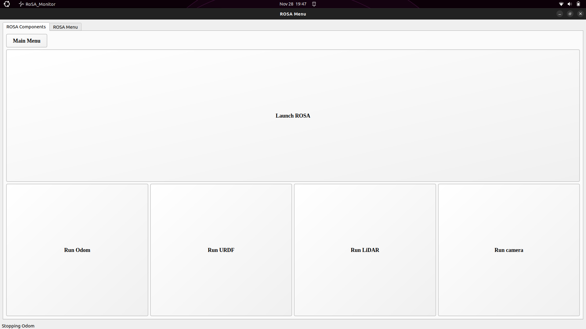

# ROSA MONITOR

**To correctly run this monitor you must have a workspace with all the ROSA packages:**
**Poner los necesarios**

This monitor is intended to run by a ROSA developper, and it is made to mostly avoid console work during the developement. It is composed by three different windows whose features are explained below:

## Main Window

This is the first and main window in the monitor. It is composed by two big buttons, that allow the user to enter in the more specific menus explained below. In the top-left area of the window it is located the workspace configuration, where user can select his ROSA workspace where ROSA packages are located. 

If a valid folder is selected as workspace text will change to the name of the folder, also the monitor will scan it looking for a "/maps" directory as the default route for saving the SLAM maps. If no "/maps" folder is found it wil be automatically created **(pending implementation: ask user to create it)**

The top-right button allow user to return to the open menu if either of them is open. Down-right this window is indicated the currently version, you can chek the changelog to notice the modifications. Down the window you can find a status bar showing info about the currently active menu.

The monitor will not allow the user to enter a second menu neither close while a first one is opened.

## ROSA Menu

This menu is supposed to be used while user is connected or working in the ROSA's NUC, it can launch all the ROSA nodes in the proper way to work woth the robot.

It is composed by two main tabs although both of them share some functionalities, even with the Simulation Menu. 
 - The "Main menu" button minimize the window to navigate to the Main menu. Every process is launched in a hidden shell whose output is printed in a new tab in the menu. 
 - All the launcher buttons are checked buttons, which means that if a process is running and his button is pressed, the process will be stopped. 
 - If any launcher is executed and no workspace is selected from the main menu, the monitor will open a dialog to select a folder as a workspace. 
 - To close this menu the user must stop all the running processes, but instead of doing it manually, a dialog asking to shut down the processes will appear when the close button is pressed.

This tab is made to launch the required ROSA's components. It shows the ROS2 integrated components of ROSA, the top long button shows a checklist of components to launch with a "Launch all" option, which will check or unncheck all the components in the list. If the user only wants to launch one of the components they are individually located under the "Launch ROSA" button. 

**(pending implementation: RGBD Node)**

**(pending implementation: Status log of nodes)**

Tis tab is made to develop with ROSA. The main functionalities of ROSA (SLAM and navigation) have buttons on the right part of the tab, while the ROS2 and ROSA debug tools buttons are implemented in the left part. 

This tab also have a "Select map" area similar to the "Select workspace" area in the Main window. It is used to configurate the navigation launcher and if it is pressed it will open the "/maps" directory by default. If no map is selected when Navigation is launched the monitor wil ask the user to select one ".yaml" file before execute it.

Both SLAM and Navigation buttons open a preconfigured RVIZ, as explained in the rosa_description package of the ROSA workspace, so when the user presses one of these buttons with the RVIZ from debug tools opened, the monitor will warn and ask the user if he wants to close the first RVIZ.

The "Print transform tree" will run the view_frames node in a directory previously asked to the user

## Simulation Menu

## Demos Menu

**(pending implementation)**