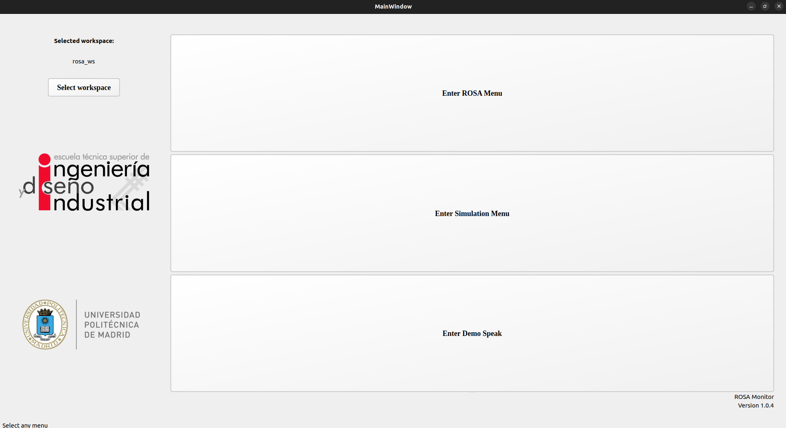
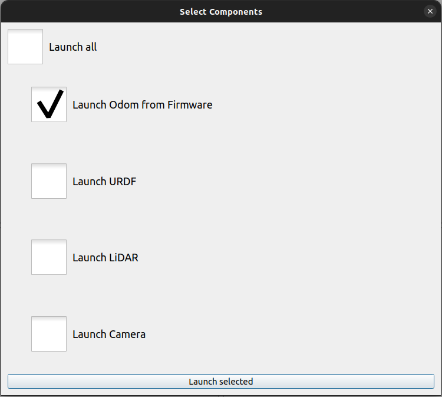
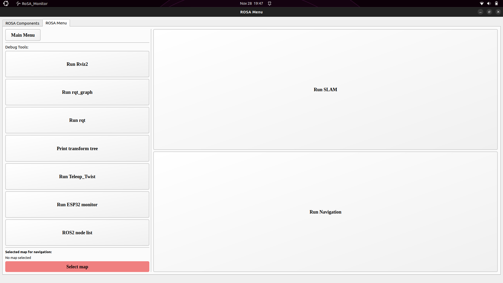
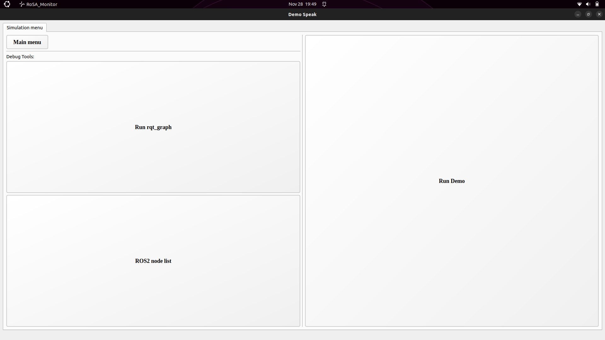

# ROSA MONITOR

**To correctly run this monitor you must have a workspace with all the ROSA packages:**
**You can find the packages [here](https://github.com/PabloNH00/rosa_robot)**
**Launchers and ROSA' functionalities are explained in the rosa_robot repository**

This monitor is intended to run by a ROSA developper, and it is made to mostly avoid console work during the developement. It is composed by three different windows, ROSA Menu, to work with ROSA robot, simulation menu, to work without using the real robot, and Demo menu which contains a speak demo using the rosa_audio package

This three windows share some functionalities and structures such as:
 - The "Main menu" button minimize the window to navigate to the Main menu. 
 - Every process is launched in a hidden shell whose output is printed in a new tab in the menu. 
 - Tabs with the processes output will close if the process is stoped from the monitor
 - All the launcher buttons are checked buttons, which means that if a process is running and his button is pressed, the process will be stopped. 
 - If any launcher is executed and no workspace is selected from the main menu, the monitor will open a dialog to select a folder as a workspace. 
 - If a workspace is selected from this dialog it is updated in the main menu when returned to it.
 - If the workspace is updated from the main menu when some other menu is running it will also be updated in this other menu
 - To close this menu the user must stop all the running processes, but instead of doing it manually, a dialog asking to shut down the processes will appear when the close button is pressed.
 - Any action from the user that can cause malfunctions are prohibited with disclaimers or solved by code

## Main Window

This is the first and main window in the monitor. It is composed by three big buttons, that allow the user to enter in the more specific menus explained below. In the top-left area of the window it is located the workspace configuration, where user can select his ROSA workspace where ROSA packages are located. 

If a valid folder is selected as workspace, the text will change to the name of the folder, also the monitor will scan it looking for a "/maps" directory as the default route for saving the SLAM maps. If no "/maps" folder is found it wil be automatically created. When launching navigation, the map selection will open this folder if exists, either /home directory will be opened

The top-right button allow user to return to the open menu if either of them is opened. Down-right this window is indicated the currently version (you can chek the changelog to notice the modifications). Down left the window you can find a status bar showing info about the currently active menu.

The monitor will not allow the user to enter a second menu neither close main window while any other menu is opened.

## ROSA Menu

This menu is supposed to be used while user is connected or working in the ROSA's NUC, it can launch all the ROSA nodes in the proper way to work with the robot.

It is composed by two main tabs.

 

This tab is made to launch the required ROSA's components. It shows the ROS2 integrated components of ROSA. The top horizontal button shows a checklist of components to launch with a "Launch all" option, which will check or unncheck all the components in the list. If the user only wants to launch one of the components they are individually located under the "Launch ROSA" button. 
**In the code, the rosa_driver node is refered as "firmware" although it actually is the node to manage the odometry**

Tis tab is made to develop with ROSA. The main functionalities of ROSA (SLAM and navigation) have buttons on the right part of the tab, while the ROS2 and ROSA debug tools buttons are implemented in the left part. 

This tab also have a "Select map" area similar to the "Select workspace" area in the Main window. It is used to configure the navigation launcher and if it is pressed it will open the "/maps" directory by default. If no map is selected when Navigation is launched the monitor wil ask the user to select one ".yaml" file before execute it.

To launch SLAM or Navigation a /scan topic and a joint between odom and base_footprint must be active, so if user tries to run any of this launchers before that, the application will ask for launch Odometry, URDF and LiDAR. 
Both SLAM and Navigation buttons open a preconfigured RVIZ, as explained in the rosa_description package of the ROSA workspace, so when the user presses one of these buttons with the RVIZ from debug tools opened, the monitor will warn and ask the user if he wants to close the first RVIZ.

The "Print transform tree" will run the view_frames node in a directory previously asked to the user. The node list button prints the list in the new tab that clean the output every time a launcher is executed. **Node list could update faster than the execution of the nodes, if the output is not the expected wait a few seconds and try to update the list manually with the button.**

## Simulation Menu

This menu is oriented to work from another computer simulating ROSA. It has the same buttons as ROSA Menu tab excluding the specific launcher for ROSA robot ESP32 monitor. It also has a Gazebo Launcher button to run the simulation. As Gazebo launch all the components as plugins it is not necessary any launcher for components.

As same as in ROSA Menu, odometry and LiDAR must be running to SLAM and navigate. In this case this is provided from Gazebo, so the application will ask to launch it if necessary. Other buttons and functionalities are the same for this menu and ROSA Menu.

## Demos Menu

This is an extra menu that uses rosa_audio package to run the Speech-To-Text and Text-To-Speech demo. 

It only has the demo launcher, rqt_graph and node list buttons since none of the others are necessary.
